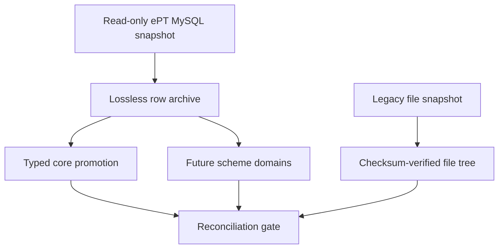

# Database parity decisions

## Why the databases are not plug-and-play

The legacy application uses MySQL and a scheme-specific relational model. This application targets PostgreSQL and currently has fewer, more generic domains. Pointing the Java application at the old database would therefore be unsafe: SQL dialects, data types, identifiers, constraints, enum values, and relationships differ.

Batch migration is the supported bridge. It separates preservation from interpretation:

## Important semantic decisions

| Concern | Decision |
| --- | --- |
| Target database | PostgreSQL remains the production database |
| Unmapped fields | Preserve the complete source row in `legacy_payload`; never silently drop it |
| Unmapped tables | Preserve all records in `legacy_record_archive` pending a typed domain slice |
| IDs | Keep source IDs as strings and map them to generated PostgreSQL IDs in `migration_id_map` |
| Dates/times | Preserve source wall-clock text in the archive; parse only valid typed values during promotion |
| Binary columns | Base64 in the archive |
| Deletes between snapshots | Report as `stale_rows`; do not silently delete target history |
| Authentication | Preserve legacy hashes/tokens for audit and controlled transition; do not automatically activate them |
| Scheme results | Preserve losslessly first; implement per-scheme typed mappings with fixture-based tests later |
| UI | Out of scope for this migration layer |

## Follow-up domain slices

Each follow-up can be reviewed independently:

1. Add the typed Liquibase schema and Java domain for one legacy table family.
2. Add a promotion SQL file keyed by `legacy_source_id`.
3. Register its source/target pair in `LegacyMigrationReconciliationService`.
4. Test the mapper against an anonymized source fixture, including nulls, invalid legacy dates, and relationship gaps.
5. Confirm source archive count equals identity-map count before enabling the domain in production.

This pattern avoids a second risky big-bang rewrite while maintaining an auditable path to full typed parity.
